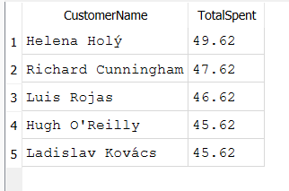

# SQL Project – Chinook Sales Insights 🎧

This project explores customer and sales data using the Chinook sample music database.

## Dataset

- **Chinook**: A mock digital music store database (.sqlite format)
- Contains tables for customers, artists, albums, invoices, and more.

## Folder Structure

- `chinook.sqlite`: The SQLite database file
- `queries/`: All `.sql` queries used in analysis
- `images/`: Visuals or screenshots of results

## Queries

- ✅ [Top 5 Customers by Spend](queries/top_customers.sql)

### Preview:

## Author

Yasir Imam
